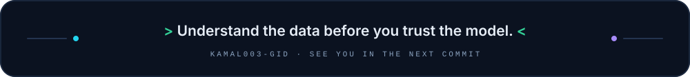

  

  
  

## Hi, I'm Kamalnath 👋

I build for the web end to end — **React interfaces, Python services, and the models sitting between them**. Most of my work starts as a question ("why is this number wrong?") and ends as something a person can actually click: a dashboard, an API, a pipeline that doesn't fall over at 2 a.m.

- **Frontend** — React 19, Tailwind CSS, shadcn/ui, Recharts, React Router, forms wired with Zod + React Hook Form
- **Backend & data** — Python, FastAPI, pandas, NumPy, scikit-learn, XGBoost, LightGBM, SHAP
- **AI plumbing** — OpenAI / Gemini via LiteLLM, OpenCV for vision work, LLM-generated summaries on top of real numbers
- **Also** — REST API design, exploratory data analysis, pytest, Git/GitHub

I'm not precious about the stack. I start with what solves the problem, then clean it up.

## How I Move an Idea to Shipped

  

The five stages, in plain text

| Stage | What actually happens |
| :--- | :--- |
| **01 · Scope** | Write the problem in one sentence · Name the user · List what is explicitly out of scope |
| **02 · Design** | Sketch the data model first · Agree on the API shape · Pick the boring, proven option |
| **03 · Build** | Vertical slice, end to end · Ugly but working beats beautiful but theoretical |
| **04 · Verify** | Test the edge cases on purpose · Read the tracebacks · Check the outputs against reality |
| **05 · Learn** | Ship it · Watch what users actually do · Fold the lesson back into stage 01 |

## Selected Work

### Marketing Analytics Platform — [`kamal003-gid/SRM`](https://github.com/kamal003-gid/SRM)

**An end-to-end analytics product: raw marketing data in, decisions out.**

A full-stack dashboard built around a real analysis pipeline rather than a mock API. Exploratory data analysis and preprocessing run in Python, models are trained and compared (scikit-learn, XGBoost, LightGBM), and SHAP explains *why* a customer was scored the way they were. The React 19 + Tailwind + shadcn/ui frontend consumes a FastAPI service with Axios and renders it through Recharts. The insight layer uses OpenAI/Gemini through LiteLLM so the narrative summary is generated from the actual model output — not from a template. Covered by pytest suites and a documented test-report workflow.

      

**[→ See the code](https://github.com/kamal003-gid/SRM)**

---

### Smart City Management — *In active development*

**Civic operations as a dashboard instead of paperwork.**

A management dashboard for city operations: complaints, services and requests in one place, with role-based views so a resident, an operator and an admin each see the slice they need. The repository is the blank canvas for this one — the schema, the API contract and the role model come first, then the UI gets built on top of something that doesn't need rewriting later.

  

**[→ Repository](https://github.com/kamal003-gid/smart-city-management)**

---

### AI Utilities — [`codealpha_tasks`](https://github.com/kamal003-gid/codealpha_tasks)

**Three small, complete tools — shipped, not tutorials-in-progress.**

| Project | What it does | Stack |
| :--- | :--- | :--- |
| [Object Detection](https://github.com/kamal003-gid/codealpha_tasks) | Real-time detection from a camera or video feed | Python · OpenCV |
| [FAQ Chatbot](https://github.com/kamal003-gid/codealpha_tasks) | Retrieval-style assistant that answers from a question set | Python · NLP |
| [Language Translator](https://github.com/kamal003-gid/codealpha_tasks) | Text translation with a small web interface | Python · HTML/CSS |

Each one is small enough to understand in one sitting and finished enough to actually run — which is the whole point of building them.

---

## Principles I Keep

| Principle | In practice |
| :--- | :--- |
| **Understand the data first** | A chart beats a hypothesis. I profile the data before I model it. |
| **Ship the smallest honest version** | Real users > perfect plans. V1 goes out, then earns its next feature. |
| **Design the empty state** | If the zero-case and the error-case look good, the happy path takes care of itself. |
| **Automate the tenth time** | The first nine times are learning. The tenth is a script. |
| **Leave a real README** | Future me is a stranger with no memory of why. |

## Currently

- 🔨 **Building** — the Smart City Management dashboard: auth, role-based views, and a complaints workflow that actually closes tickets
- 📚 **Learning** — system design and FastAPI beyond the tutorial part; tuning gradient-boosted models and reading SHAP plots properly
- 🌱 **Improving** — writing tests that fail for real reasons, not just for coverage
- 💬 **Open to** — internships, junior full-stack roles, and small freelance web builds

## Contribution Graph

  

## Stats

  
  

  

## Let's Connect

  
  &nbsp;
  

  

